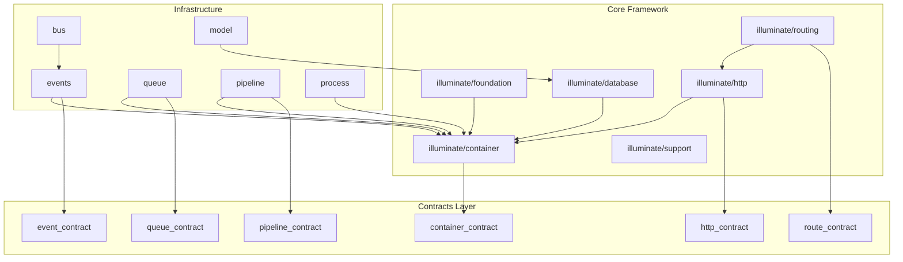
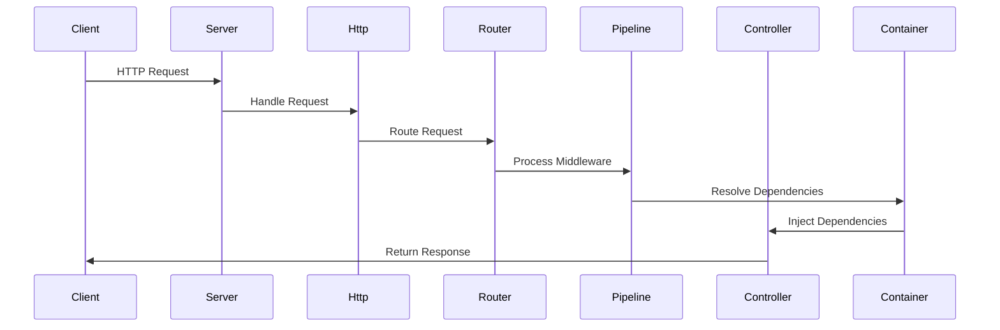
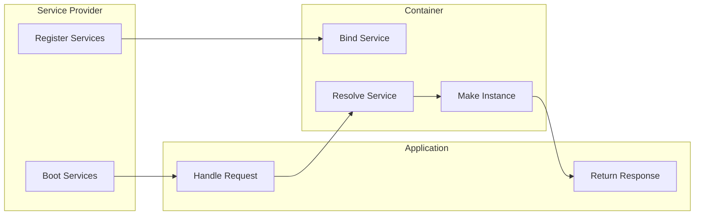
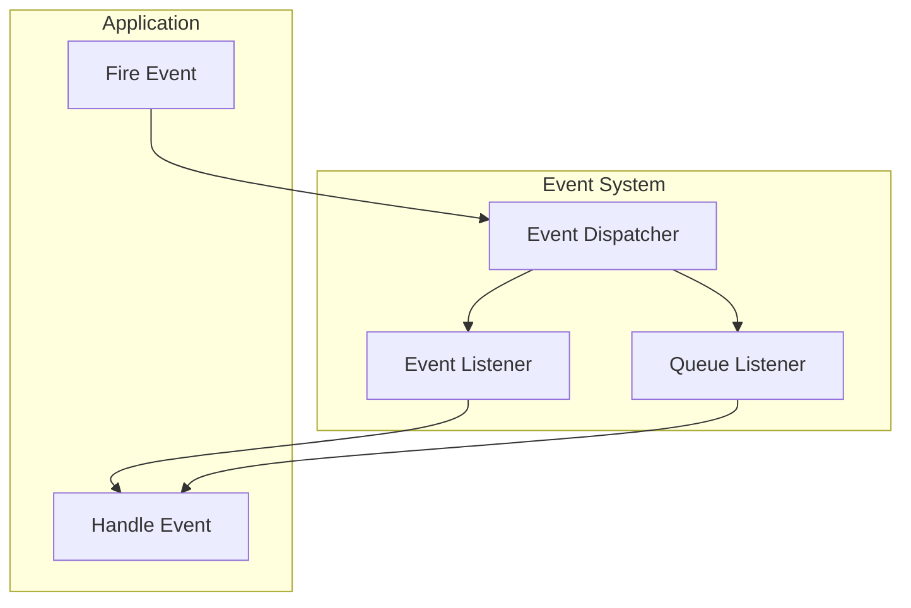
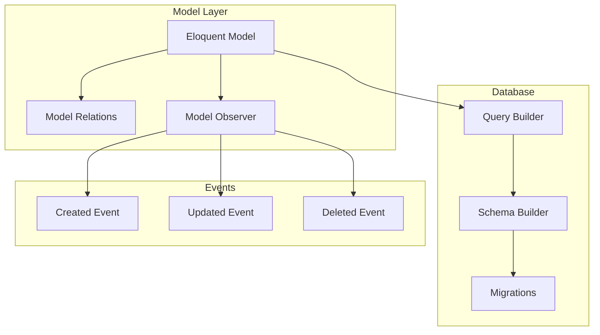

# Platform Architecture Diagrams

## Package Architecture


## Request Lifecycle


## Service Container Flow


## Event System


## Database Layer


## Package Dependencies
```mermaid
graph TD
    subgraph Core ["Core Packages"]
        Container[container]
        Support[support]
        Foundation[foundation]
    end

    subgraph Features ["Feature Packages"]
        Http[http]
        Routing[routing]
        Database[database]
        Cache[cache]
    end

    subgraph Infrastructure ["Infrastructure"]
        Events[events]
        Queue[queue]
        Pipeline[pipeline]
    end

    %% Core Dependencies
    Support --> Container
    Foundation --> Container
    Foundation --> Support

    %% Feature Dependencies
    Http --> Foundation
    Routing --> Http
    Database --> Foundation
    Cache --> Foundation

    %% Infrastructure Dependencies
    Events --> Container
    Queue --> Events
    Pipeline --> Container
