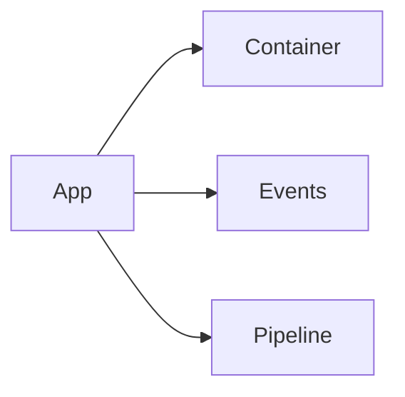
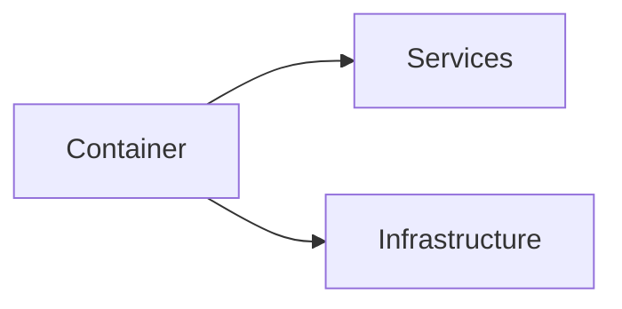
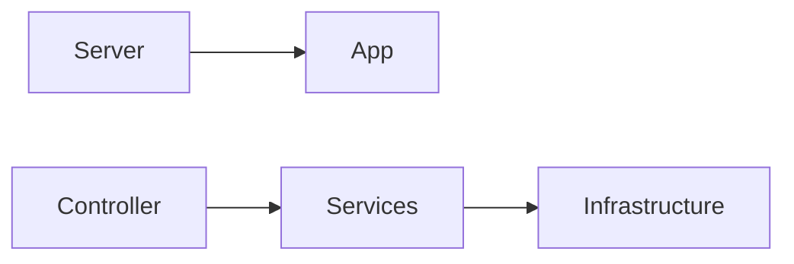
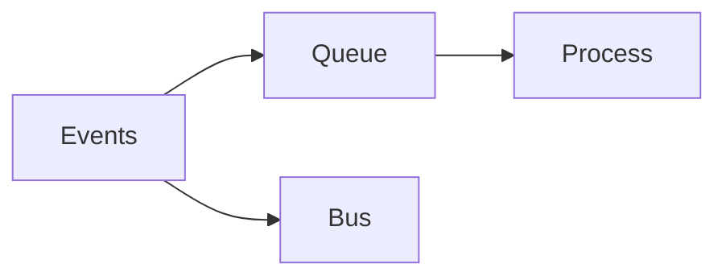

# Architecture Diagrams

## System Overview

The `system_overview.mmd` diagram shows the high-level architecture of our framework, including:

1. Core System
   - Application lifecycle
   - Dependency injection (Container)
   - Event handling
   - Pipeline processing

2. HTTP Layer
   - Server handling
   - HTTP kernel
   - Routing
   - Controllers

3. Service Layer
   - Configuration
   - Caching
   - Queue management
   - Database operations

4. Infrastructure
   - Filesystem operations
   - Process management
   - Command bus
   - Model layer

5. Testing Integration
   - Test cases
   - HTTP testing
   - Database testing
   - Event testing

## Rendering the Diagram

### Using Mermaid CLI
```bash
# Install Mermaid CLI
npm install -g @mermaid-js/mermaid-cli

# Generate SVG
mmdc -i system_overview.mmd -o system_overview.svg

# Generate PNG
mmdc -i system_overview.mmd -o system_overview.png
```

### Using Online Tools
1. Visit [Mermaid Live Editor](https://mermaid.live)
2. Copy content of system_overview.mmd
3. Export as SVG or PNG

### Using VSCode
1. Install "Markdown Preview Mermaid Support" extension
2. Open system_overview.mmd
3. Use preview to view diagram

## Modifying the Diagram

### Component Structure
```mermaid
%% Component Template
subgraph ComponentName ["Display Name"]
    Node1[Node One]
    Node2[Node Two]
    
    Node1 --> Node2
end
```

### Style Definitions
```mermaid
%% Style Classes
classDef core fill:#f9f,stroke:#333,stroke-width:2px
classDef http fill:#bbf,stroke:#333,stroke-width:2px
classDef service fill:#bfb,stroke:#333,stroke-width:2px
classDef infra fill:#fbb,stroke:#333,stroke-width:2px
classDef test fill:#fff,stroke:#333,stroke-width:2px
```

### Adding Components
1. Define component in appropriate subgraph
2. Add relationships using arrows
3. Apply style class
4. Update documentation

## Component Descriptions

### Core System
- **Application**: Main entry point and lifecycle manager
- **Container**: Dependency injection container
- **Events**: Event dispatching and handling
- **Pipeline**: Request/process pipeline handling

### HTTP Layer
- **Server**: HTTP server implementation
- **Kernel**: HTTP request kernel
- **Router**: Route matching and handling
- **Controller**: Request controllers

### Service Layer
- **Config**: Configuration management
- **Cache**: Data caching
- **Queue**: Job queue management
- **Database**: Database operations

### Infrastructure
- **FileSystem**: File operations
- **Process**: Process management
- **Bus**: Command bus implementation
- **Model**: Data model layer

### Testing
- **TestCase**: Base test functionality
- **HttpTest**: HTTP testing utilities
- **DBTest**: Database testing utilities
- **EventTest**: Event testing utilities

## Relationships

### Core Dependencies


### Service Registration


### Request Flow


### Event Flow


## Best Practices

1. **Adding Components**
   - Place in appropriate subgraph
   - Use consistent naming
   - Add clear relationships
   - Apply correct style

2. **Updating Relationships**
   - Keep lines clear
   - Show direct dependencies
   - Avoid crossing lines
   - Group related flows

3. **Maintaining Styles**
   - Use defined classes
   - Keep consistent colors
   - Maintain line weights
   - Use clear labels

4. **Documentation**
   - Update README.md
   - Explain changes
   - Document relationships
   - Keep synchronized

## Questions?

For questions about architecture diagrams:
1. Check diagram documentation
2. Review Mermaid syntax
3. Consult team leads
4. Update documentation
