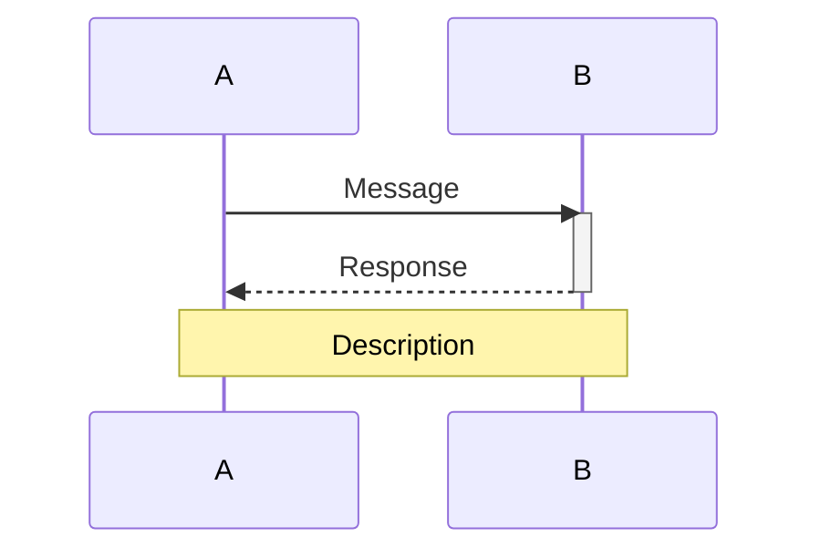
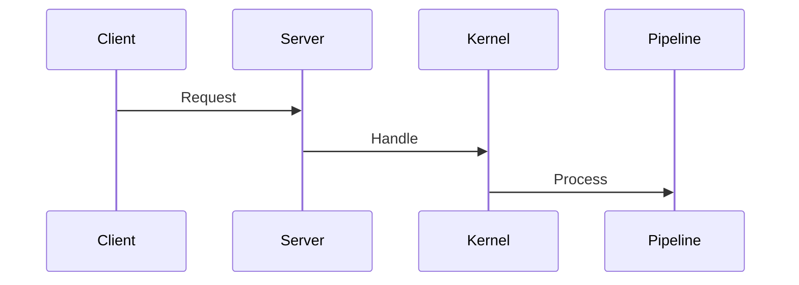
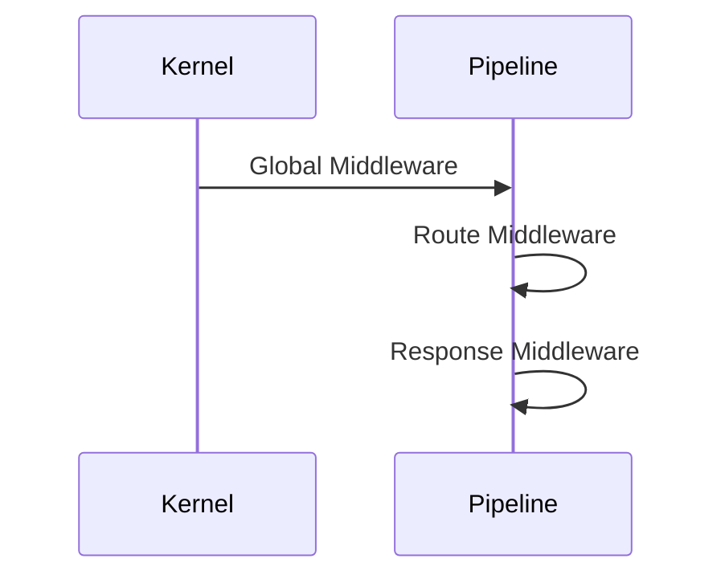
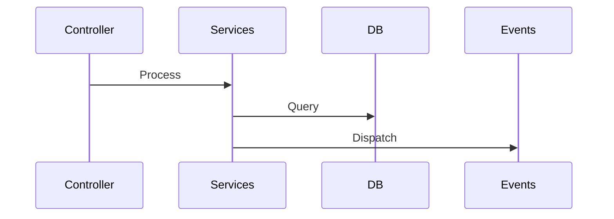
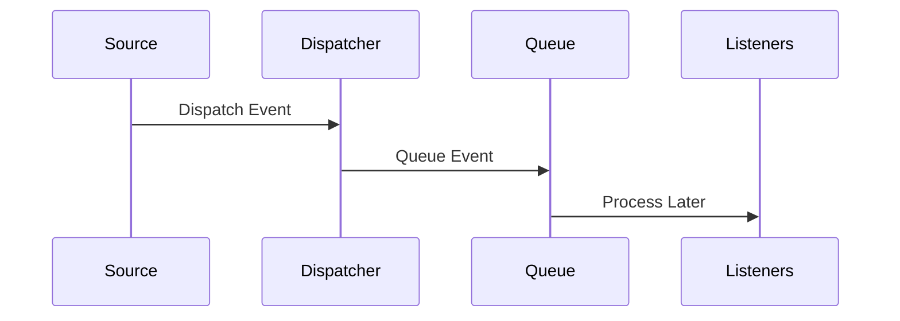
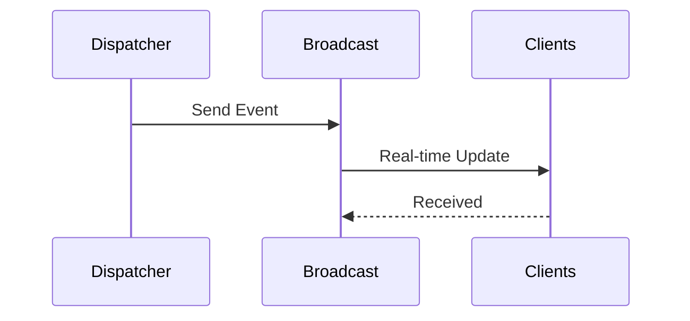
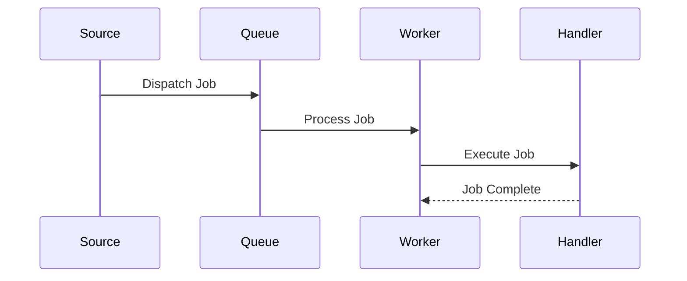
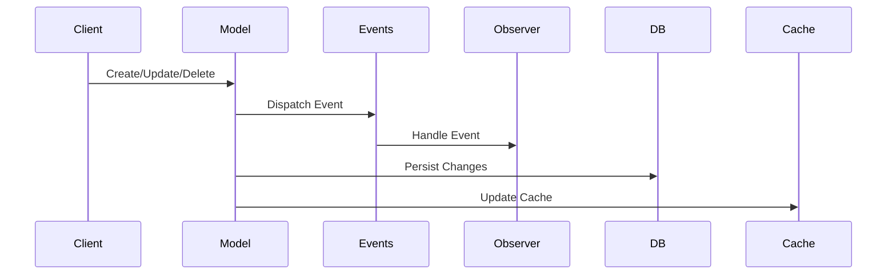

# Flow Diagrams

## Request Lifecycle

The `request_lifecycle.mmd` diagram shows the complete lifecycle of an HTTP request through our framework, including:

### 1. Entry Points
- Client HTTP Request
- Server Reception
- Kernel Handling

### 2. Middleware Processing
1. **Global Middleware**
   - Maintenance Mode Check
   - Post Size Validation
   - String Trimming
   - Empty to Null Conversion

2. **Route Middleware**
   - Authentication
   - Authorization
   - Throttling
   - CSRF Protection

3. **Response Middleware**
   - Session Handling
   - Cookie Processing
   - Header Management
   - Response Compression

### 3. Core Processing
1. **Route Resolution**
   - Pattern Matching
   - Parameter Binding
   - Controller Resolution

2. **Controller Handling**
   - Action Execution
   - Parameter Injection
   - Response Generation

### 4. Service Layer
1. **Business Logic**
   - Service Processing
   - Data Validation
   - Business Rules

2. **Data Operations**
   - Database Queries
   - Cache Access
   - File Operations

### 5. Event System
1. **Event Types**
   - Model Events
   - Custom Events
   - System Events

2. **Event Processing**
   - Synchronous Events
   - Queued Events
   - Broadcast Events

## Event Processing

The `event_processing.mmd` diagram shows the complete lifecycle of events through our framework, including:

### 1. Event Sources
- System Components
- User Actions
- External Triggers
- Scheduled Tasks

### 2. Event Types
1. **Immediate Events**
   - Synchronous Processing
   - Direct Response
   - In-Memory Handling

2. **Queued Events**
   - Asynchronous Processing
   - Background Jobs
   - Delayed Execution

3. **Broadcast Events**
   - Real-time Updates
   - WebSocket Integration
   - Channel Broadcasting

### 3. Processing Components
1. **Event Dispatcher**
   - Event Creation
   - Type Detection
   - Handler Resolution
   - Event Routing

2. **Queue System**
   - Job Queuing
   - Background Processing
   - Retry Handling
   - Failed Job Management

3. **Broadcaster**
   - Channel Management
   - Real-time Delivery
   - Client Connections
   - Message Formatting

4. **Event Listeners**
   - Event Handling
   - Business Logic
   - Response Generation
   - Error Handling

### 4. Integration Points
1. **Database Operations**
   - Transaction Management
   - Data Persistence
   - State Changes
   - Audit Logging

2. **Cache Operations**
   - Cache Invalidation
   - Cache Updates
   - Performance Optimization
   - State Management

3. **Event Subscribers**
   - Multiple Event Handling
   - Event Grouping
   - Subscriber Management
   - Event Filtering

### 5. Channel Types
1. **Public Channels**
   - Open Access
   - Public Events
   - General Updates

2. **Private Channels**
   - Authentication Required
   - User-Specific Events
   - Secure Communication

3. **Presence Channels**
   - User Presence
   - Online Status
   - User Lists
   - Real-time State

## Queue Processing

The `queue_processing.mmd` diagram shows the complete lifecycle of queued jobs through our framework, including:

### 1. Job Sources
- Application Code
- Event Listeners
- Scheduled Tasks
- External Triggers

### 2. Job States
1. **Pending**
   - Initial State
   - Awaiting Processing
   - In Queue

2. **Reserved**
   - Worker Assigned
   - Being Processed
   - Locked for Processing

3. **Released**
   - Failed Attempt
   - Ready for Retry
   - Back in Queue

4. **Failed**
   - Max Retries Exceeded
   - Permanent Failure
   - Requires Attention

### 3. Processing Components
1. **Queue Manager**
   - Job Registration
   - Queue Selection
   - Job Scheduling
   - State Management

2. **Queue Worker**
   - Job Processing
   - Error Handling
   - Retry Management
   - Resource Cleanup

3. **Job Handler**
   - Business Logic
   - Data Processing
   - Event Dispatching
   - Error Reporting

4. **Failed Jobs**
   - Failure Logging
   - Retry Tracking
   - Error Analysis
   - Admin Notification

### 4. Integration Points
1. **Database Operations**
   - Job Storage
   - State Tracking
   - Transaction Management
   - Failure Logging

2. **Event System**
   - Job Events
   - Status Updates
   - Error Notifications
   - Progress Tracking

3. **Queue Monitor**
   - Health Checks
   - Performance Metrics
   - Worker Status
   - Error Rates

### 5. Processing Types
1. **Immediate Processing**
   - Direct Execution
   - No Delay
   - Synchronous Option

2. **Delayed Processing**
   - Scheduled Execution
   - Time-based Delays
   - Future Processing

3. **Batch Processing**
   - Multiple Jobs
   - Grouped Execution
   - Bulk Operations

4. **Chained Processing**
   - Sequential Jobs
   - Dependent Tasks
   - Pipeline Processing

### 6. Retry Strategy
1. **Exponential Backoff**
   - Increasing Delays
   - Retry Limits
   - Failure Thresholds

2. **Custom Delays**
   - Job-specific Timing
   - Conditional Delays
   - Priority-based

3. **Max Attempts**
   - Attempt Limits
   - Failure Handling
   - Final State

## Model Lifecycle

The `model_lifecycle.mmd` diagram shows the complete lifecycle of models through our framework, including:

### 1. Model Operations
1. **Creation**
   - Instance Creation
   - Event Dispatching
   - Database Insertion
   - Cache Management

2. **Retrieval**
   - Cache Checking
   - Database Query
   - Relationship Loading
   - Model Hydration

3. **Update**
   - Change Tracking
   - Event Dispatching
   - Database Update
   - Cache Invalidation

4. **Deletion**
   - Event Dispatching
   - Database Deletion
   - Cache Clearing
   - Relationship Cleanup

### 2. Event Integration
1. **Lifecycle Events**
   - Creating/Created
   - Updating/Updated
   - Deleting/Deleted
   - Retrieved/Saving

2. **Relationship Events**
   - Loading Relations
   - Relation Loaded
   - Relation Updated
   - Relation Deleted

3. **Cache Events**
   - Cache Hit/Miss
   - Cache Stored
   - Cache Invalidated
   - Cache Cleared

### 3. Processing Components
1. **Model Instance**
   - Attribute Management
   - Change Tracking
   - Event Dispatching
   - State Management

2. **Event System**
   - Event Creation
   - Observer Notification
   - Queue Integration
   - Event Broadcasting

3. **Cache Layer**
   - Cache Checking
   - Cache Storage
   - Cache Invalidation
   - Cache Strategy

4. **Database Layer**
   - Query Execution
   - Record Management
   - Transaction Handling
   - Relationship Loading

### 4. Integration Points
1. **Observer System**
   - Lifecycle Hooks
   - Event Handling
   - State Tracking
   - Custom Logic

2. **Cache Strategy**
   - Read Through
   - Write Behind
   - Cache Invalidation
   - Cache Tags

3. **Queue Integration**
   - Event Queueing
   - Job Processing
   - Async Operations
   - Retry Handling

### 5. Model States
1. **Pending**
   - New Instance
   - Not Persisted
   - No Events

2. **Active**
   - Persisted
   - Trackable
   - Observable

3. **Modified**
   - Changes Tracked
   - Events Pending
   - Cache Invalid

4. **Deleted**
   - Soft Deleted
   - Hard Deleted
   - Cache Cleared

### 6. Performance Features
1. **Eager Loading**
   - Relationship Loading
   - Query Optimization
   - N+1 Prevention

2. **Cache Management**
   - Query Cache
   - Model Cache
   - Relationship Cache

3. **Batch Operations**
   - Bulk Insert
   - Bulk Update
   - Bulk Delete

## Rendering the Diagrams

### Using Mermaid CLI
```bash
# Install Mermaid CLI
npm install -g @mermaid-js/mermaid-cli

# Generate SVG
mmdc -i request_lifecycle.mmd -o request_lifecycle.svg
mmdc -i event_processing.mmd -o event_processing.svg
mmdc -i queue_processing.mmd -o queue_processing.svg
mmdc -i model_lifecycle.mmd -o model_lifecycle.svg

# Generate PNG
mmdc -i request_lifecycle.mmd -o request_lifecycle.png
mmdc -i event_processing.mmd -o event_processing.png
mmdc -i queue_processing.mmd -o queue_processing.png
mmdc -i model_lifecycle.mmd -o model_lifecycle.png
```

### Using Online Tools
1. Visit [Mermaid Live Editor](https://mermaid.live)
2. Copy content of .mmd files
3. Export as SVG or PNG

### Using VSCode
1. Install "Markdown Preview Mermaid Support" extension
2. Open .mmd files
3. Use preview to view diagrams

## Modifying the Diagrams

### Sequence Structure


### Style Definitions
```mermaid
style Client fill:#f9f,stroke:#333,stroke-width:2px
style Server fill:#bbf,stroke:#333,stroke-width:2px
style Kernel fill:#bbf,stroke:#333,stroke-width:2px
style Pipeline fill:#bfb,stroke:#333,stroke-width:2px
```

### Adding Components
1. Add participant declaration
2. Add message sequences
3. Add activation/deactivation
4. Add notes and descriptions

## Component Interactions

### 1. Request Processing


### 2. Middleware Chain


### 3. Business Logic


### 4. Event Flow


### 5. Broadcasting


### 6. Queue Processing


### 7. Model Operations


## Component Details

### HTTP Layer
- **Server**: Handles raw HTTP requests
- **Kernel**: Manages request processing
- **Pipeline**: Executes middleware chain
- **Router**: Matches routes to controllers

### Processing Layer
- **Controller**: Handles business logic
- **Services**: Processes domain logic
- **Events**: Manages system events
- **Database**: Handles data persistence

### Event System
- **Dispatcher**: Central event hub
- **Queue**: Async processing
- **Broadcast**: Real-time updates
- **Listeners**: Event handlers

### Queue System
- **Manager**: Queue management
- **Worker**: Job processing
- **Handler**: Job execution
- **Monitor**: Health checks

### Model System
- **Model**: Data representation
- **Observer**: Event handling
- **Cache**: Performance layer
- **Relations**: Relationship management

### Integration Points
- **Database**: Data persistence
- **Cache**: Performance layer
- **Subscribers**: Event consumers
- **External Systems**: Third-party services

### Processing Types
- **Synchronous**: Immediate processing
- **Asynchronous**: Queued processing
- **Real-time**: Broadcast processing
- **Batch**: Grouped processing

### Event Categories
- **System Events**: Framework operations
- **Domain Events**: Business logic
- **User Events**: User actions
- **Integration Events**: External systems

## Best Practices

### 1. Adding Sequences
- Use clear message names
- Show activation state
- Add relevant notes
- Group related actions

### 2. Updating Flow
- Maintain sequence order
- Show parallel operations
- Indicate async processes
- Document timing

### 3. Maintaining Style
- Use consistent colors
- Keep clear spacing
- Add helpful notes
- Use proper arrows

### 4. Documentation
- Update README.md
- Explain changes
- Document new flows
- Keep synchronized

### 5. Event Design
- Use clear event names
- Include necessary data
- Consider async needs
- Plan broadcast strategy

### 6. Queue Management
- Set appropriate delays
- Handle failures
- Monitor queue size
- Implement retries

### 7. Broadcast Strategy
- Choose correct channels
- Manage authentication
- Handle disconnections
- Optimize payload

### 8. Error Handling
- Log failures
- Implement retries
- Notify administrators
- Maintain state

### 9. Model Operations
- Track changes
- Manage cache
- Handle events
- Optimize queries

## Questions?

For questions about flow diagrams:
1. Check diagram documentation
2. Review Mermaid syntax
3. Consult team leads
4. Update documentation
