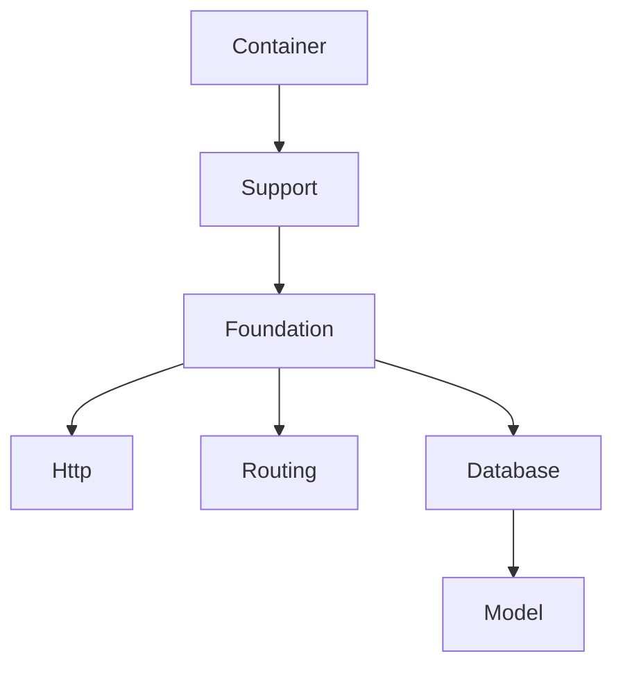

# Laravel Platform Implementation Plan

This document outlines our plan to implement a Laravel-compatible platform in Dart, using Lucifer as a base and following the IDD-AI methodology with AI assistance.

## Overview

### Goals
1. 100% Laravel API compatibility
2. Clean, maintainable Dart implementation
3. Package independence
4. Excellent developer experience

### Strategy
1. Use Lucifer as minimal foundation
2. Break into illuminate/* packages
3. Follow Laravel's architecture
4. Leverage AI assistance
5. Follow IDD-AI methodology

## Implementation Phases

### Phase 1: Foundation
Starting with Lucifer's base:

1. Container (Complete)
   - [x] Our implementation done
   - [x] Laravel API compatible
   - [x] Tests complete

2. Support Package (Next)
   ```dart
   // Example of Laravel compatibility
   // Laravel: Str::slug('Laravel Framework')
   // Dart: Str.slug('Laravel Framework')
   ```
   AI Tasks:
   - `/ai analyze-laravel Support`
   - `/ai suggest-implementation Support`
   - `/ai generate-tests Support`

3. Foundation Package
   ```dart
   // Example of service provider registration
   // Laravel: $app->register(CacheServiceProvider::class)
   // Dart: app.register(CacheServiceProvider())
   ```
   AI Tasks:
   - `/ai analyze-laravel Foundation`
   - `/ai suggest-architecture Foundation`
   - `/ai generate-contracts Foundation`

### Phase 2: HTTP Layer

1. HTTP Package
   ```dart
   // Example of request handling
   // Laravel: $request->input('name')
   // Dart: request.input('name')
   ```
   AI Tasks:
   - `/ai analyze-laravel Http`
   - `/ai suggest-implementation Request`
   - `/ai generate-tests Http`

2. Routing Package
   ```dart
   // Example of route definition
   // Laravel: Route::get('/users', [UserController::class, 'index'])
   // Dart: Route.get('/users', UserController.index)
   ```
   AI Tasks:
   - `/ai analyze-laravel Routing`
   - `/ai suggest-implementation Router`
   - `/ai check-compatibility Routing`

### Phase 3: Database Layer

1. Database Package
   ```dart
   // Example of query builder
   // Laravel: DB::table('users')->where('active', true)->get()
   // Dart: DB.table('users').where('active', true).get()
   ```
   AI Tasks:
   - `/ai analyze-laravel Database`
   - `/ai suggest-implementation QueryBuilder`
   - `/ai generate-tests Database`

2. Model Package
   ```dart
   // Example of model definition
   // Laravel: class User extends Model
   // Dart: class User extends Model
   ```
   AI Tasks:
   - `/ai analyze-laravel Model`
   - `/ai suggest-implementation Model`
   - `/ai check-compatibility Model`

## Development Process

For each package:

1. Research Phase
   ```bash
   # Analyze Laravel implementation
   /ai analyze-laravel [package]
   
   # Get architecture suggestions
   /ai suggest-architecture [package]
   ```

2. Implementation Phase
   ```bash
   # Generate package structure
   /ai generate-structure [package]
   
   # Get implementation guidance
   /ai suggest-implementation [package]
   ```

3. Testing Phase
   ```bash
   # Generate tests
   /ai generate-tests [package]
   
   # Verify Laravel compatibility
   /ai verify-behavior [package]
   ```

4. Documentation Phase
   ```bash
   # Generate docs
   /ai generate-docs [package]
   
   # Create examples
   /ai create-examples [package]
   ```

## Package Dependencies



## Quality Assurance

1. API Compatibility
   ```bash
   # Check API compatibility
   /ai check-compatibility [package]
   
   # Verify behavior
   /ai verify-behavior [package]
   ```

2. Testing
   ```bash
   # Generate comprehensive tests
   /ai generate-tests [package] --comprehensive
   
   # Check test coverage
   /ai analyze-coverage [package]
   ```

3. Documentation
   ```bash
   # Generate package docs
   /ai generate-docs [package]
   
   # Create migration guide
   /ai generate-migration-guide [package]
   ```

## Next Steps

1. Begin with Support package:
   - [ ] Analyze Laravel's Support package
   - [ ] Create package structure
   - [ ] Implement core functionality
   - [ ] Add tests and documentation

2. Move to Foundation:
   - [ ] Design service provider system
   - [ ] Implement application class
   - [ ] Set up bootstrapping

3. Continue with HTTP/Routing:
   - [ ] Design HTTP abstractions
   - [ ] Implement routing system
   - [ ] Add middleware support

## Related Documents
- [IDD-AI Specification](idd_ai_specification.md)
- [AI Assistance Guide](ai_assistance_guide.md)
- [AI Workflow](ai_workflow.md)
