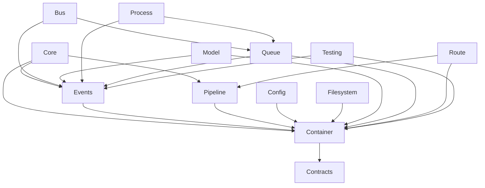

# Framework Documentation

## Core Documentation

### Getting Started
1. [Getting Started Guide](getting_started.md)
2. [Laravel Compatibility Roadmap](laravel_compatibility_roadmap.md)
3. [Foundation Integration Guide](foundation_integration_guide.md)
4. [Testing Guide](testing_guide.md)
5. [Package Integration Map](package_integration_map.md)

### Core Architecture
1. [Core Architecture](core_architecture.md)
   - System design
   - Architectural patterns
   - Extension points
   - Package integration

## Package Documentation

### Core Framework
1. Core Package
   - [Core Package Specification](core_package_specification.md)
   - [Core Architecture](core_architecture.md)

2. Container Package
   - [Container Package Specification](container_package_specification.md)
   - [Container Gap Analysis](container_gap_analysis.md)
   - [Container Feature Integration](container_feature_integration.md)
   - [Container Migration Guide](container_migration_guide.md)

3. Contracts Package
   - [Contracts Package Specification](contracts_package_specification.md)

4. Events Package
   - [Events Package Specification](events_package_specification.md)
   - [Events Gap Analysis](events_gap_analysis.md)

5. Pipeline Package
   - [Pipeline Package Specification](pipeline_package_specification.md)
   - [Pipeline Gap Analysis](pipeline_gap_analysis.md)

6. Support Package
   - [Support Package Specification](support_package_specification.md)

### Infrastructure
1. Bus Package
   - [Bus Package Specification](bus_package_specification.md)
   - [Bus Gap Analysis](bus_gap_analysis.md)

2. Config Package
   - [Config Package Specification](config_package_specification.md)
   - [Config Gap Analysis](config_gap_analysis.md)

3. Filesystem Package
   - [Filesystem Package Specification](filesystem_package_specification.md)
   - [Filesystem Gap Analysis](filesystem_gap_analysis.md)

4. Model Package
   - [Model Package Specification](model_package_specification.md)
   - [Model Gap Analysis](model_gap_analysis.md)

5. Process Package
   - [Process Package Specification](process_package_specification.md)
   - [Process Gap Analysis](process_gap_analysis.md)

6. Queue Package
   - [Queue Package Specification](queue_package_specification.md)
   - [Queue Gap Analysis](queue_gap_analysis.md)

7. Route Package
   - [Route Package Specification](route_package_specification.md)
   - [Route Gap Analysis](route_gap_analysis.md)

8. Testing Package
   - [Testing Package Specification](testing_package_specification.md)
   - [Testing Gap Analysis](testing_gap_analysis.md)

## Package Dependencies



## Implementation Status

### Core Framework (90%)
- Core Package (95%)
  * Application lifecycle ✓
  * Service providers ✓
  * HTTP kernel ✓
  * Console kernel ✓
  * Exception handling ✓
  * Needs: Performance optimizations

- Container Package (90%)
  * Basic DI ✓
  * Auto-wiring ✓
  * Service providers ✓
  * Needs: Contextual binding

- Events Package (85%)
  * Event dispatching ✓
  * Event subscribers ✓
  * Event broadcasting ✓
  * Needs: Event discovery

### Infrastructure (80%)
- Bus Package (85%)
  * Command dispatching ✓
  * Command queuing ✓
  * Needs: Command batching

- Config Package (80%)
  * Configuration repository ✓
  * Environment loading ✓
  * Needs: Config caching

- Filesystem Package (75%)
  * Local driver ✓
  * Cloud storage ✓
  * Needs: Streaming support

- Model Package (80%)
  * Basic ORM ✓
  * Relationships ✓
  * Needs: Model events

- Process Package (85%)
  * Process management ✓
  * Process pools ✓
  * Needs: Process monitoring

- Queue Package (85%)
  * Queue workers ✓
  * Job batching ✓
  * Needs: Rate limiting

- Route Package (90%)
  * Route registration ✓
  * Route matching ✓
  * Middleware ✓
  * Needs: Route caching

- Testing Package (85%)
  * HTTP testing ✓
  * Database testing ✓
  * Needs: Browser testing

## Development Workflow

1. **Starting Development**
   ```bash
   # Clone repository
   git clone https://github.com/organization/framework.git
   
   # Install dependencies
   dart pub get
   
   # Run tests
   dart test
   ```

2. **Development Process**
   - Write tests first
   - Implement features
   - Update documentation
   - Submit PR

3. **Quality Checks**
   - Run tests
   - Check code style
   - Verify documentation
   - Review performance

## Contributing

See [CONTRIBUTING.md](../CONTRIBUTING.md) for detailed contribution guidelines.

### Quick Start
1. Review [Getting Started Guide](getting_started.md)
2. Check [Laravel Compatibility Roadmap](laravel_compatibility_roadmap.md)
3. Read relevant package documentation
4. Follow [Testing Guide](testing_guide.md)

## Resources

### Documentation
- [Laravel Documentation](https://laravel.com/docs)
- [Dart Documentation](https://dart.dev/guides)
- [Package Layout](https://dart.dev/tools/pub/package-layout)

### Tools
- [Dart SDK](https://dart.dev/get-dart)
- [VS Code](https://code.visualstudio.com)
- [Git](https://git-scm.com)

### Community
- GitHub Issues
- Discussion Forum
- Team Chat

## License

This framework is open-sourced software licensed under the [MIT license](../LICENSE).
