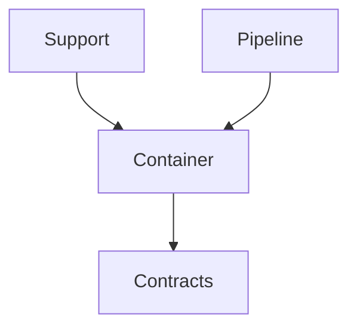
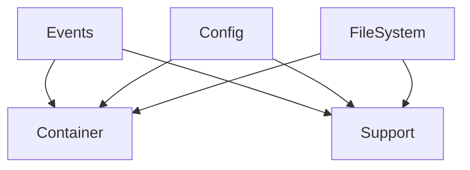
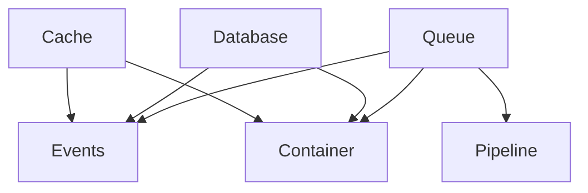
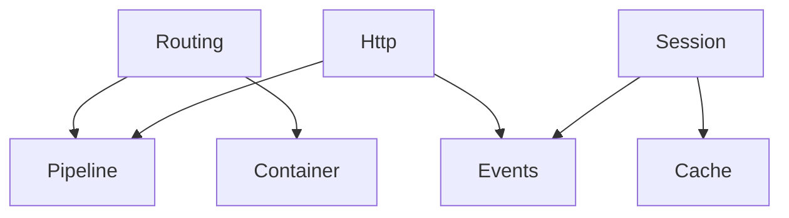

# Laravel Compatibility Roadmap

## Overview

This document outlines our path to Laravel API compatibility while maintaining backward compatibility with existing code. It provides a comprehensive view of package dependencies, implementation status, and migration strategy.

## Package Dependency Hierarchy

### Level 0: Core Foundation


Core Dependencies:
- Container: Service container, dependency injection
- Contracts: Interfaces and contracts
- Support: Helper functions, utilities
- Pipeline: Pipeline pattern implementation

### Level 1: Infrastructure


Infrastructure Dependencies:
- Events: Event dispatching system
- Config: Configuration management
- FileSystem: File system abstraction

### Level 2: Core Services


Core Service Dependencies:
- Cache: Caching system
- Database: Database abstraction
- Queue: Queue system and job processing

### Level 3: HTTP Layer


HTTP Layer Dependencies:
- Routing: Route registration and matching
- Http: HTTP request/response handling
- Session: Session management

## Current Implementation Status

[Previous implementation status section remains the same]

## Success Metrics

### 1. API Compatibility
```yaml
Required:
- 100% Laravel interface implementation
- All Laravel patterns supported
- Full feature parity
- Backward compatibility maintained
```

### 2. Performance
```yaml
Targets:
- Resolution: < 0.1ms per operation
- Memory: < 10MB overhead
- Cache hit rate: > 90%
- Startup time: < 100ms
```

### 3. Code Quality
```yaml
Requirements:
- 100% test coverage
- Static analysis passing
- Documentation complete
- Examples provided
```

### 4. Integration
```yaml
Verification:
- Cross-package tests passing
- Performance benchmarks met
- Real-world examples working
- Migration guides verified
```

## Key Design Decisions

### 1. Backward Compatibility
```dart
// Maintain existing APIs
class Container {
  // Existing methods stay the same
  T make<T>();
  void bind<T>(T instance);
  
  // New methods add functionality
  ContextualBindingBuilder when(Type concrete);
  void tag(List<Type> types, String tag);
}
```

### 2. Laravel Compatibility
```dart
// Match Laravel's patterns
container.when(UserController)
        .needs<Service>()
        .give((c) => SpecialService());

container.tag([ServiceA, ServiceB], 'services');

container.call(instance, 'method', parameters);
```

### 3. Performance Focus
```dart
// Add caching
class Container {
  final ResolutionCache _cache;
  final ReflectionCache _reflectionCache;
  
  T make<T>([dynamic context]) {
    return _cache.get<T>(context) ?? _resolve<T>(context);
  }
}
```

## Implementation Strategy

[Previous implementation strategy section remains the same]

## Integration Considerations

### 1. Service Provider Pattern
- Registration phase
- Boot phase
- Deferred providers

### 2. Event System
- Synchronous events
- Queued events
- Event subscribers

### 3. Queue System
- Multiple drivers
- Job handling
- Failed jobs

### 4. Database Layer
- Query builder
- Schema builder
- Migrations

### 5. HTTP Layer
- Middleware
- Controllers
- Resources

### 6. Authentication
- Guards
- Providers
- Policies

## Getting Started

### 1. Development Environment
```bash
# Clone repository
git clone https://github.com/org/platform.git

# Install dependencies
dart pub get

# Run tests
dart test
```

### 2. Package Development
```yaml
1. Choose package level:
   - Level 0: Foundation packages
   - Level 1: Infrastructure packages
   - Level 2: Core services
   - Level 3: HTTP layer

2. Review dependencies:
   - Check required packages
   - Verify integration points
   - Plan implementation

3. Follow implementation order:
   - Core functionality
   - Laravel compatibility
   - Tests and documentation
```

### 3. Quality Assurance
```yaml
1. Testing:
   - Unit tests
   - Integration tests
   - Performance tests
   - Compatibility tests

2. Documentation:
   - API documentation
   - Usage examples
   - Integration guides
   - Migration guides

3. Performance:
   - Benchmarking
   - Profiling
   - Optimization
```

## Next Steps

[Previous next steps section remains the same]

Would you like me to:
1. Create detailed plans for package creation?
2. Start implementing specific features?
3. Create test plans for new functionality?
