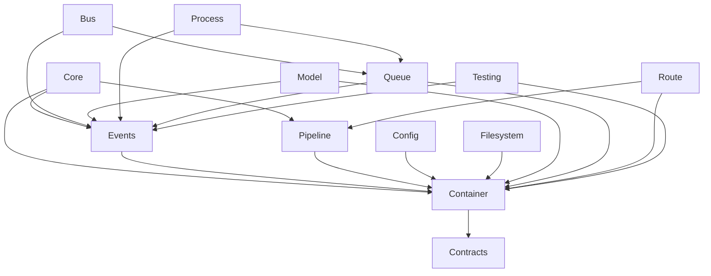

# Package Integration Map

## Overview

This document maps out the integration points between our framework packages and outlines how to maintain and enhance these integrations while achieving Laravel API compatibility.

> **Related Documentation**
> - See [Core Architecture](core_architecture.md) for system design
> - See [Laravel Compatibility Roadmap](laravel_compatibility_roadmap.md) for implementation status
> - See [Foundation Integration Guide](foundation_integration_guide.md) for integration patterns
> - See [Testing Guide](testing_guide.md) for testing approaches

## Package Documentation

### Core Framework
1. Core Package
   - [Core Package Specification](core_package_specification.md)
   - [Core Architecture](core_architecture.md)

2. Container Package
   - [Container Package Specification](container_package_specification.md)
   - [Container Gap Analysis](container_gap_analysis.md)
   - [Container Feature Integration](container_feature_integration.md)
   - [Container Migration Guide](container_migration_guide.md)

3. Contracts Package
   - [Contracts Package Specification](contracts_package_specification.md)

4. Events Package
   - [Events Package Specification](events_package_specification.md)
   - [Events Gap Analysis](events_gap_analysis.md)

5. Pipeline Package
   - [Pipeline Package Specification](pipeline_package_specification.md)
   - [Pipeline Gap Analysis](pipeline_gap_analysis.md)

6. Support Package
   - [Support Package Specification](support_package_specification.md)

### Infrastructure
1. Bus Package
   - [Bus Package Specification](bus_package_specification.md)
   - [Bus Gap Analysis](bus_gap_analysis.md)

2. Config Package
   - [Config Package Specification](config_package_specification.md)
   - [Config Gap Analysis](config_gap_analysis.md)

3. Filesystem Package
   - [Filesystem Package Specification](filesystem_package_specification.md)
   - [Filesystem Gap Analysis](filesystem_gap_analysis.md)

4. Model Package
   - [Model Package Specification](model_package_specification.md)
   - [Model Gap Analysis](model_gap_analysis.md)

5. Process Package
   - [Process Package Specification](process_package_specification.md)
   - [Process Gap Analysis](process_gap_analysis.md)

6. Queue Package
   - [Queue Package Specification](queue_package_specification.md)
   - [Queue Gap Analysis](queue_gap_analysis.md)

7. Route Package
   - [Route Package Specification](route_package_specification.md)
   - [Route Gap Analysis](route_gap_analysis.md)

8. Testing Package
   - [Testing Package Specification](testing_package_specification.md)
   - [Testing Gap Analysis](testing_gap_analysis.md)

## Core Integration Points

### 1. Container Integration Hub
```dart
// All packages integrate with Container for dependency injection
class ServiceProvider {
  final Container container;
  
  // Current Integration
  void register() {
    container.registerSingleton<Service>(ServiceImpl());
  }
  
  // Laravel-Compatible Enhancement
  void register() {
    // Add contextual binding
    container.when(Service).needs<Logger>().give(FileLogger());
    
    // Add tagged binding
    container.tag([
      EmailNotifier,
      SmsNotifier,
      PushNotifier
    ], 'notifications');
  }
}
```

### 2. Event System Integration
```dart
// Events package integrates with multiple packages
class EventServiceProvider {
  // Current Integration
  void register() {
    // Queue Integration
    container.singleton<QueuedEventDispatcher>((c) => 
      QueuedEventDispatcher(
        queue: c.make<QueueContract>(),
        broadcaster: c.make<BroadcasterContract>()
      )
    );
    
    // Bus Integration
    container.singleton<CommandDispatcher>((c) =>
      CommandDispatcher(
        events: c.make<EventDispatcherContract>(),
        queue: c.make<QueueContract>()
      )
    );
  }
  
  // Laravel-Compatible Enhancement
  void register() {
    // Add event discovery
    container.singleton<EventDiscovery>((c) =>
      EventDiscovery(c.make<Reflector>())
    );
    
    // Add after commit handling
    container.singleton<DatabaseEventDispatcher>((c) =>
      DatabaseEventDispatcher(
        events: c.make<EventDispatcherContract>(),
        db: c.make<DatabaseManager>()
      )
    );
  }
}
```

### 3. Queue and Bus Integration
```dart
// Queue and Bus packages work together for job handling
class QueuedCommandDispatcher {
  // Current Integration
  Future<void> dispatch(Command command) async {
    if (command is ShouldQueue) {
      await queue.push(QueuedCommandJob(command));
    } else {
      await commandBus.dispatch(command);
    }
  }
  
  // Laravel-Compatible Enhancement
  Future<void> dispatch(Command command) async {
    // Add job middleware
    var job = QueuedCommandJob(command)
      ..through([
        RateLimitedMiddleware(),
        WithoutOverlappingMiddleware()
      ]);
      
    // Add job batching
    if (command is BatchableCommand) {
      await queue.batch([job])
        .allowFailures()
        .dispatch();
    } else {
      await queue.push(job);
    }
  }
}
```

### 4. Route and Core Integration
```dart
// Route package integrates with Core for HTTP handling
class RouterServiceProvider {
  // Current Integration
  void register() {
    container.singleton<Router>((c) =>
      Router()
        ..use(LoggingMiddleware())
        ..use(AuthMiddleware())
    );
  }
  
  // Laravel-Compatible Enhancement
  void register() {
    // Add model binding
    container.singleton<RouteModelBinder>((c) =>
      RouteModelBinder(
        models: c.make<ModelRegistry>(),
        db: c.make<DatabaseManager>()
      )
    );
    
    // Add subdomain routing
    container.singleton<SubdomainRouter>((c) =>
      SubdomainRouter(
        domains: c.make<DomainRegistry>(),
        router: c.make<Router>()
      )
    );
  }
}
```

### 5. Process and Queue Integration
```dart
// Process package integrates with Queue for background tasks
class ProcessManager {
  // Current Integration
  Future<void> runProcess(String command) async {
    var process = await Process.start(command);
    queue.push(ProcessMonitorJob(process.pid));
  }
  
  // Laravel-Compatible Enhancement
  Future<void> runProcess(String command) async {
    // Add scheduling
    scheduler.job(ProcessJob(command))
      .everyFiveMinutes()
      .withoutOverlapping()
      .onFailure((e) => notifyAdmin(e));
      
    // Add process pools
    processPool.job(command)
      .onServers(['worker-1', 'worker-2'])
      .dispatch();
  }
}
```

### 6. Model and Event Integration
```dart
// Model package integrates with Events for model events
class ModelEventDispatcher {
  // Current Integration
  Future<void> save(Model model) async {
    await events.dispatch(ModelSaving(model));
    await db.save(model);
    await events.dispatch(ModelSaved(model));
  }
  
  // Laravel-Compatible Enhancement
  Future<void> save(Model model) async {
    // Add transaction awareness
    await db.transaction((tx) async {
      await events.dispatch(ModelSaving(model));
      await tx.save(model);
      
      // Queue after commit
      events.afterCommit(() =>
        events.dispatch(ModelSaved(model))
      );
    });
  }
}
```

## Package-Specific Integration Points

### 1. Container Package
```dart
// Integration with other packages
class Container {
  // Current
  void bootstrap() {
    registerSingleton<EventDispatcher>();
    registerSingleton<QueueManager>();
    registerSingleton<CommandBus>();
  }
  
  // Enhanced
  void bootstrap() {
    // Add service repository
    registerSingleton<ServiceRepository>((c) =>
      ServiceRepository([
        EventServiceProvider(),
        QueueServiceProvider(),
        BusServiceProvider()
      ])
    );
    
    // Add deferred loading
    registerDeferred<ReportGenerator>((c) =>
      ReportGenerator(c.make<Database>())
    );
  }
}
```

### 2. Events Package
```dart
// Integration with other packages
class EventDispatcher {
  // Current
  Future<void> dispatch(Event event) async {
    if (event is QueuedEvent) {
      await queue.push(event);
    } else {
      await notifyListeners(event);
    }
  }
  
  // Enhanced
  Future<void> dispatch(Event event) async {
    // Add broadcast channels
    if (event is BroadcastEvent) {
      await broadcast.to(event.channels)
        .with(['queue' => queue.connection()])
        .send(event);
    }
    
    // Add event subscribers
    await container.make<EventSubscriberRegistry>()
      .dispatch(event);
  }
}
```

### 3. Queue Package
```dart
// Integration with other packages
class QueueManager {
  // Current
  Future<void> process() async {
    while (true) {
      var job = await queue.pop();
      await job.handle();
    }
  }
  
  // Enhanced
  Future<void> process() async {
    // Add worker management
    worker.supervise((worker) {
      worker.process('default')
        .throughMiddleware([
          RateLimited::class,
          PreventOverlapping::class
        ])
        .withEvents(events);
    });
  }
}
```

## Integration Enhancement Strategy

1. **Container Enhancements**
   - Add contextual binding
   - Add tagged bindings
   - Keep existing integrations working

2. **Event System Enhancements**
   - Add event discovery
   - Add after commit handling
   - Maintain existing event flow

3. **Queue System Enhancements**
   - Add job batching
   - Add better job middleware
   - Keep existing job handling

4. **Route System Enhancements**
   - Add model binding
   - Add subdomain routing
   - Maintain existing routing

5. **Process System Enhancements**
   - Add scheduling
   - Add process pools
   - Keep existing process management

6. **Model System Enhancements**
   - Add Eloquent features
   - Add relationships
   - Maintain existing model events

## Implementation Steps

1. **Document Current Integration Points**
   - Map all package dependencies
   - Document integration interfaces
   - Note existing functionality

2. **Plan Laravel-Compatible Interfaces**
   - Review Laravel's interfaces
   - Design compatible interfaces
   - Plan migration strategy

3. **Implement Enhancements**
   - Start with Container enhancements
   - Add Event enhancements
   - Add Queue enhancements
   - Continue with other packages

4. **Test Integration Points**
   - Test existing functionality
   - Test new functionality
   - Test Laravel compatibility

5. **Migration Guide**
   - Document breaking changes
   - Provide upgrade path
   - Include examples

## Package Dependencies



## Implementation Status

### Core Framework (90%)
- Core Package (95%)
  * Application lifecycle ✓
  * Service providers ✓
  * HTTP kernel ✓
  * Console kernel ✓
  * Exception handling ✓
  * Needs: Performance optimizations

- Container Package (90%)
  * Basic DI ✓
  * Auto-wiring ✓
  * Service providers ✓
  * Needs: Contextual binding

- Events Package (85%)
  * Event dispatching ✓
  * Event subscribers ✓
  * Event broadcasting ✓
  * Needs: Event discovery

### Infrastructure (80%)
- Bus Package (85%)
  * Command dispatching ✓
  * Command queuing ✓
  * Needs: Command batching

- Config Package (80%)
  * Configuration repository ✓
  * Environment loading ✓
  * Needs: Config caching

- Filesystem Package (75%)
  * Local driver ✓
  * Cloud storage ✓
  * Needs: Streaming support

- Model Package (80%)
  * Basic ORM ✓
  * Relationships ✓
  * Needs: Model events

- Process Package (85%)
  * Process management ✓
  * Process pools ✓
  * Needs: Process monitoring

- Queue Package (85%)
  * Queue workers ✓
  * Job batching ✓
  * Needs: Rate limiting

- Route Package (90%)
  * Route registration ✓
  * Route matching ✓
  * Middleware ✓
  * Needs: Route caching

- Testing Package (85%)
  * HTTP testing ✓
  * Database testing ✓
  * Needs: Browser testing

## Development Guidelines

### 1. Getting Started
Before implementing integrations:
1. Review [Getting Started Guide](getting_started.md)
2. Check [Laravel Compatibility Roadmap](laravel_compatibility_roadmap.md)
3. Follow [Testing Guide](testing_guide.md)
4. Use [Foundation Integration Guide](foundation_integration_guide.md)

### 2. Implementation Process
For each integration:
1. Write tests following [Testing Guide](testing_guide.md)
2. Implement following Laravel patterns
3. Document following [Getting Started Guide](getting_started.md#documentation)
4. Integrate following [Foundation Integration Guide](foundation_integration_guide.md)

### 3. Quality Requirements
All integrations must:
1. Pass all tests (see [Testing Guide](testing_guide.md))
2. Meet Laravel compatibility requirements
3. Follow integration patterns (see [Foundation Integration Guide](foundation_integration_guide.md))
4. Match package specifications

### 4. Documentation Requirements
Integration documentation must:
1. Explain integration patterns
2. Show usage examples
3. Cover error handling
4. Include performance tips
5. Follow standards in [Getting Started Guide](getting_started.md#documentation)
