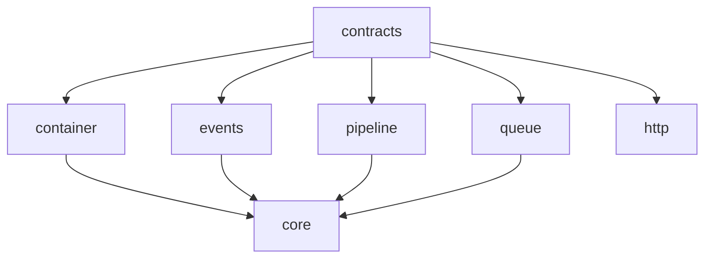

# Platform Project Map

## Package Structure

### Core Packages
```
packages/
  illuminate/          # Laravel-compatible implementations
    container/        # ✓ Complete
    support/         # In Progress
    http/           # Planned
    routing/        # Planned
    ...

  contracts/         # ✓ Complete
    lib/src/
      container/    # Container contracts
      events/      # Event dispatcher contracts
      http/        # HTTP contracts
      pipeline/    # Pipeline contracts
      queue/       # Queue contracts
      ...

  core/             # Core functionality
    lib/src/
      core/        # Core components
      http/        # HTTP implementation
      http2/       # HTTP/2 support
```

### Infrastructure Packages
```
packages/
  bus/              # Command/Event bus
  events/           # Event system
  model/            # Data models
  pipeline/         # Pipeline processing
  process/          # Process management
  queue/            # Queue system
  route/            # Routing system
  support/          # Support utilities
  testing/          # Testing utilities
```

## Package Dependencies



## Implementation Status

### Core Framework
1. Container Package ✓
   - [x] Basic container
   - [x] Service providers
   - [x] Auto-wiring
   - [x] Contextual binding
   - [x] Method injection

2. Contracts Package ✓
   - [x] Container contracts
   - [x] Event contracts
   - [x] HTTP contracts
   - [x] Pipeline contracts
   - [x] Queue contracts

3. Core Package
   - [x] Base application
   - [x] HTTP kernel
   - [x] Service providers
   - [ ] Configuration
   - [ ] Environment handling

### Infrastructure
1. Events Package
   - [x] Event dispatcher
   - [x] Event subscribers
   - [ ] Event broadcasting
   - [ ] Queued events

2. Pipeline Package
   - [x] Pipeline processing
   - [x] Middleware support
   - [ ] Pipeline stages
   - [ ] Error handling

3. Queue Package
   - [x] Queue manager
   - [x] Job dispatching
   - [ ] Failed jobs
   - [ ] Job batching

4. Route Package
   - [x] Route registration
   - [x] Route matching
   - [ ] Route groups
   - [ ] Route caching

## Laravel API Compatibility

### Implemented
1. Container API
   ```dart
   // Laravel: app()->bind()
   container.bind<Service>((c) => ServiceImpl());
   
   // Laravel: app()->singleton()
   container.singleton<Cache>((c) => RedisCache());
   ```

2. Events API
   ```dart
   // Laravel: Event::dispatch()
   events.dispatch(UserCreated(user));
   
   // Laravel: Event::listen()
   events.listen<UserCreated>((event) => ...);
   ```

### In Progress
1. Support Package
   ```dart
   // Laravel: Str::slug()
   Str.slug('Laravel Framework');
   
   // Laravel: collect()
   Collection.collect(['a', 'b']);
   ```

2. HTTP Package
   ```dart
   // Laravel: Request::input()
   request.input('name');
   
   // Laravel: Response::json()
   response.json({'status': 'success'});
   ```

## Next Steps

1. Support Package
   - [ ] String helpers
   - [ ] Array helpers
   - [ ] Collections
   - [ ] Fluent interface

2. HTTP Package
   - [ ] Request handling
   - [ ] Response building
   - [ ] Middleware system
   - [ ] Session management

3. Database Package
   - [ ] Query builder
   - [ ] Schema builder
   - [ ] Migrations
   - [ ] Model system

## Development Workflow

1. Package Development
   ```bash
   # Create new package
   dart create packages/illuminate/[package]
   
   # Set up package
   cd packages/illuminate/[package]
   dart pub get
   ```

2. Testing
   ```bash
   # Run tests
   dart test
   
   # Check coverage
   dart test --coverage
   ```

3. Documentation
   ```bash
   # Generate docs
   dart doc .
   
   # Serve docs
   dhttpd --path doc/api
   ```

## Resources

1. Documentation
   - [Framework Documentation](README.md)
   - [IDD-AI Specification](idd_ai_specification.md)
   - [AI Workflow](ai_workflow.md)

2. Specifications
   - [Core Package Specification](core_package_specification.md)
   - [Container Package Specification](container_package_specification.md)
   - [Support Package Specification](support_package_specification.md)

3. Analysis
   - [Container Gap Analysis](container_gap_analysis.md)
   - [Events Gap Analysis](events_gap_analysis.md)
   - [Pipeline Gap Analysis](pipeline_gap_analysis.md)
