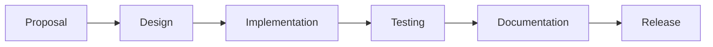

# Platform Reflection Roadmap

This document outlines the planned improvements and future direction of the Platform Reflection library.

## Current Status (v0.1.0)

### Implemented Features
✅ Basic reflection system
✅ Property access/mutation
✅ Method invocation
✅ Constructor handling
✅ Type introspection
✅ Basic metadata support
✅ Error handling
✅ Cross-platform support

### Known Limitations
❌ No cross-isolate reflection
❌ Limited generic support
❌ No source location tracking
❌ No extension method support
❌ No mixin composition
❌ Limited metadata capabilities
❌ No dynamic proxy generation
❌ No attribute-based reflection

## Short-term Goals (v0.2.0)

### 1. Enhanced Generic Support
- [ ] Better generic type handling
- [ ] Generic type argument preservation
- [ ] Generic method support
- [ ] Generic constructor support
- [ ] Type parameter constraints

### 2. Improved Type System
- [ ] Better type relationship checking
- [ ] Variance handling
- [ ] Type erasure handling
- [ ] Generic type instantiation
- [ ] Type parameter bounds

### 3. Metadata Enhancements
- [ ] Rich metadata API
- [ ] Metadata inheritance
- [ ] Custom metadata providers
- [ ] Metadata validation
- [ ] Compile-time metadata

### 4. Performance Optimizations
- [ ] Faster lookup mechanisms
- [ ] Better memory usage
- [ ] Optimized registration
- [ ] Improved caching
- [ ] Reduced startup time

## Medium-term Goals (v0.3.0)

### 1. Dynamic Features
- [ ] Dynamic proxy generation
- [ ] Method interception
- [ ] Property interception
- [ ] Dynamic interface implementation
- [ ] Runtime mixin application

### 2. Advanced Type Features
- [ ] Extension method support
- [ ] Operator overloading
- [ ] Mixin composition
- [ ] Type alias support
- [ ] Named constructor factories

### 3. Tooling Support
- [ ] VS Code extension
- [ ] Dart analyzer plugin
- [ ] Documentation generator
- [ ] Migration tools
- [ ] Debug tools

### 4. Framework Integration
- [ ] Flutter integration
- [ ] Built Value integration
- [ ] JSON serialization
- [ ] Database mapping
- [ ] Dependency injection

## Long-term Goals (v1.0.0)

### 1. Advanced Reflection
- [ ] Cross-isolate reflection
- [ ] Source location tracking
- [ ] Dynamic loading
- [ ] Code generation
- [ ] Hot reload support

### 2. Language Features
- [ ] Pattern matching
- [ ] Records support
- [ ] Sealed classes
- [ ] Enhanced enums
- [ ] Extension types

### 3. Enterprise Features
- [ ] Aspect-oriented programming
- [ ] Dependency injection
- [ ] Object-relational mapping
- [ ] Serialization framework
- [ ] Validation framework

### 4. Security Features
- [ ] Access control
- [ ] Reflection policies
- [ ] Sandboxing
- [ ] Audit logging
- [ ] Security annotations

## Implementation Priorities

### Phase 1: Foundation (Current)
1. Core reflection system
2. Basic type support
3. Essential operations
4. Error handling
5. Documentation

### Phase 2: Enhancement (Next)
1. Generic support
2. Type system improvements
3. Metadata enhancements
4. Performance optimizations
5. Framework integration

### Phase 3: Advanced Features
1. Dynamic capabilities
2. Language feature support
3. Tooling integration
4. Security features
5. Enterprise features

## Breaking Changes

### Planned for v0.2.0
- API refinements for generic support
- Enhanced metadata system
- Improved type handling
- Registration system updates

### Planned for v0.3.0
- Dynamic proxy API
- Advanced type features
- Framework integration APIs
- Security system

### Planned for v1.0.0
- Stable API finalization
- Enterprise feature integration
- Cross-isolate capabilities
- Advanced language features

## Migration Support

### For Each Major Version
- Migration guides
- Breaking change documentation
- Upgrade tools
- Code modification scripts
- Support period

## Community Feedback Areas

### Current Focus
1. Generic type handling
2. Performance optimization
3. Framework integration
4. API usability
5. Documentation quality

### Future Considerations
1. Enterprise features
2. Security requirements
3. Framework support
4. Language feature support
5. Tool integration

## Development Process

### 1. Feature Development

### 2. Release Cycle
- Major versions: Significant features/breaking changes
- Minor versions: New features/non-breaking changes
- Patch versions: Bug fixes/performance improvements

### 3. Testing Strategy
- Unit tests
- Integration tests
- Performance tests
- Platform compatibility tests
- Framework integration tests

## Contributing

### Priority Areas
1. Generic type support
2. Performance improvements
3. Framework integration
4. Documentation
5. Testing

### Getting Started
1. Review current limitations
2. Check roadmap priorities
3. Read contribution guidelines
4. Submit proposals
5. Implement features

## Support

### Long-term Support (LTS)
- v1.0.0 and later
- Security updates
- Critical bug fixes
- Performance improvements
- Documentation updates

### Version Support Matrix
| Version | Status | Support Until |
|---------|---------|--------------|
| 0.1.x   | Current | 6 months     |
| 0.2.x   | Planned | 1 year       |
| 0.3.x   | Planned | 1 year       |
| 1.0.x   | Planned | 2 years      |

## Success Metrics

### Technical Metrics
- Performance benchmarks
- Memory usage
- API coverage
- Test coverage
- Documentation coverage

### Community Metrics
- Adoption rate
- Issue resolution time
- Community contributions
- User satisfaction
- Framework adoption

## Get Involved

### Ways to Contribute
1. Submit bug reports
2. Propose features
3. Improve documentation
4. Add test cases
5. Implement features

### Communication Channels
- GitHub Issues
- Pull Requests
- Discord Server
- Stack Overflow
- Email Support

## Timeline

### 2024 Q1-Q2
- Enhanced generic support
- Improved type system
- Performance optimizations
- Documentation improvements

### 2024 Q3-Q4
- Dynamic features
- Framework integration
- Tool support
- Security features

### 2025
- Cross-isolate reflection
- Enterprise features
- Language feature support
- 1.0.0 release

Note: This roadmap is subject to change based on community feedback and evolving requirements.
