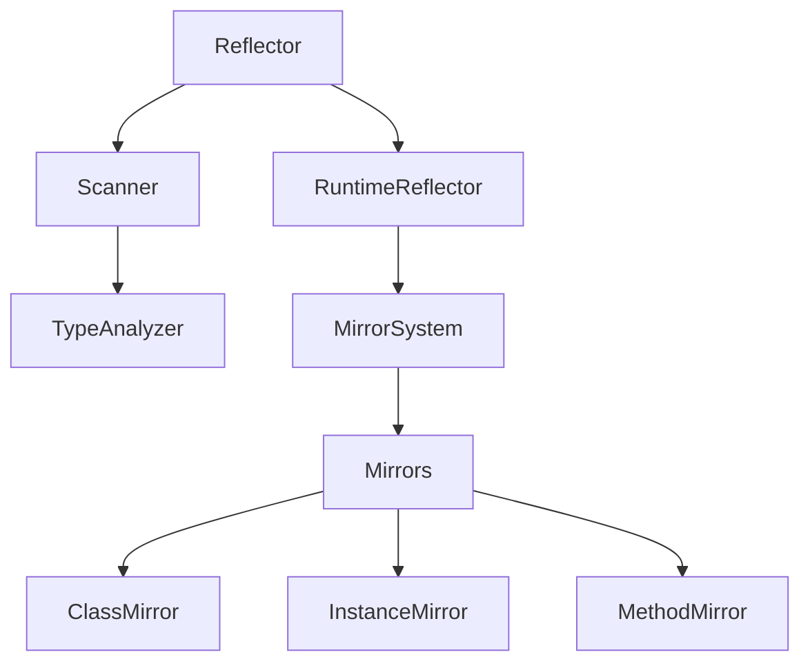

# Platform Reflection Technical Specification

## System Architecture

### Core Components



### Component Responsibilities

#### 1. Reflector
- Central registration point
- Metadata management
- Type registration validation
- Cache management

```dart
class Reflector {
  static final Map<Type, TypeMetadata> _typeCache;
  static final Map<Type, Map<String, PropertyMetadata>> _propertyMetadata;
  static final Map<Type, Map<String, MethodMetadata>> _methodMetadata;
  static final Map<Type, List<ConstructorMetadata>> _constructorMetadata;
}
```

#### 2. Scanner
- Type analysis
- Metadata extraction
- Registration validation
- Type relationship analysis

```dart
class Scanner {
  static final Map<Type, TypeInfo> _typeInfoCache;
  
  static TypeInfo analyze(Type type) {
    // Analyze class structure
    // Extract metadata
    // Build type relationships
  }
}
```

#### 3. RuntimeReflector
- Instance creation
- Method invocation
- Property access
- Type reflection

```dart
class RuntimeReflector {
  InstanceMirror reflect(Object object) {
    // Create instance mirror
    // Setup metadata access
    // Configure invocation handling
  }
}
```

### Metadata System

#### Type Metadata
```dart
class TypeMetadata {
  final Type type;
  final String name;
  final Map<String, PropertyMetadata> properties;
  final Map<String, MethodMetadata> methods;
  final List<ConstructorMetadata> constructors;
  final bool isAbstract;
  final bool isEnum;
}
```

#### Method Metadata
```dart
class MethodMetadata {
  final String name;
  final List<Type> parameterTypes;
  final List<ParameterMetadata> parameters;
  final bool returnsVoid;
  final bool isStatic;
  final bool isAbstract;
}
```

#### Property Metadata
```dart
class PropertyMetadata {
  final String name;
  final Type type;
  final bool isReadable;
  final bool isWritable;
  final bool isStatic;
}
```

## Implementation Details

### Registration Process

1. Type Registration
```dart
static void register(Type type) {
  // Validate type
  if (_typeCache.containsKey(type)) return;
  
  // Create metadata
  final metadata = TypeMetadata(
    type: type,
    name: type.toString(),
    properties: {},
    methods: {},
    constructors: [],
  );
  
  // Cache metadata
  _typeCache[type] = metadata;
}
```

2. Property Registration
```dart
static void registerProperty(
  Type type,
  String name,
  Type propertyType, {
  bool isReadable = true,
  bool isWritable = true,
}) {
  // Validate type registration
  if (!isRegistered(type)) {
    throw NotReflectableException(type);
  }
  
  // Create property metadata
  final metadata = PropertyMetadata(
    name: name,
    type: propertyType,
    isReadable: isReadable,
    isWritable: isWritable,
  );
  
  // Cache metadata
  _propertyMetadata
    .putIfAbsent(type, () => {})
    [name] = metadata;
}
```

3. Method Registration
```dart
static void registerMethod(
  Type type,
  String name,
  List<Type> parameterTypes,
  bool returnsVoid, {
  List<String>? parameterNames,
  List<bool>? isRequired,
}) {
  // Validate type registration
  if (!isRegistered(type)) {
    throw NotReflectableException(type);
  }
  
  // Create method metadata
  final metadata = MethodMetadata(
    name: name,
    parameterTypes: parameterTypes,
    parameters: _createParameters(
      parameterTypes,
      parameterNames,
      isRequired,
    ),
    returnsVoid: returnsVoid,
  );
  
  // Cache metadata
  _methodMetadata
    .putIfAbsent(type, () => {})
    [name] = metadata;
}
```

### Instance Creation

```dart
InstanceMirror createInstance(
  Type type, {
  List<dynamic>? positionalArgs,
  Map<Symbol, dynamic>? namedArgs,
  String? constructorName,
}) {
  // Get constructor metadata
  final constructors = Reflector.getConstructorMetadata(type);
  if (constructors == null) {
    throw ReflectionException('No constructors found');
  }
  
  // Find matching constructor
  final constructor = constructors.firstWhere(
    (c) => c.name == (constructorName ?? ''),
    orElse: () => throw ReflectionException('Constructor not found'),
  );
  
  // Validate arguments
  _validateArguments(
    constructor,
    positionalArgs,
    namedArgs,
  );
  
  // Create instance
  final instance = constructor.creator!(
    positionalArgs,
    namedArgs,
  );
  
  // Return mirror
  return InstanceMirror(
    instance,
    type,
  );
}
```

### Method Invocation

```dart
InstanceMirror invoke(
  Symbol methodName,
  List<dynamic> positionalArguments, [
  Map<Symbol, dynamic>? namedArguments,
]) {
  // Get method metadata
  final method = _getMethodMetadata(methodName);
  if (method == null) {
    throw ReflectionException('Method not found');
  }
  
  // Validate arguments
  _validateMethodArguments(
    method,
    positionalArguments,
    namedArguments,
  );
  
  // Invoke method
  final result = method.invoke(
    instance,
    positionalArguments,
    namedArguments,
  );
  
  // Return result mirror
  return InstanceMirror(
    result,
    result.runtimeType,
  );
}
```

## Performance Optimizations

### 1. Metadata Caching
- Type metadata cached on registration
- Method metadata cached on registration
- Property metadata cached on registration

### 2. Lookup Optimization
- O(1) type lookup
- O(1) method lookup
- O(1) property lookup

### 3. Memory Management
- Weak references for type cache
- Lazy initialization of metadata
- Minimal metadata storage

## Error Handling

### Exception Hierarchy
```dart
abstract class ReflectionException implements Exception {
  final String message;
  final StackTrace? stackTrace;
}

class NotReflectableException extends ReflectionException {
  final Type type;
}

class InvalidArgumentsException extends ReflectionException {
  final String memberName;
  final Type type;
}

class MemberNotFoundException extends ReflectionException {
  final String memberName;
  final Type type;
}
```

### Validation Points
1. Registration validation
2. Argument validation
3. Type validation
4. Access validation

## Platform Considerations

### Web Support
- No dart:mirrors dependency
- Tree-shaking friendly
- Minimal runtime overhead

### Flutter Support
- AOT compilation compatible
- No code generation required
- Performance optimized

### Native Support
- Cross-platform compatible
- No platform-specific code
- Consistent behavior

## Limitations and Constraints

### Technical Limitations
1. No cross-isolate reflection
2. No source location support
3. Limited generic support
4. No extension method support

### Design Decisions
1. Explicit registration required
2. No private member access
3. No dynamic loading
4. No proxy generation

## Future Considerations

### Planned Improvements
1. Enhanced generic support
2. Better type relationship handling
3. Improved metadata capabilities
4. Performance optimizations

### Potential Features
1. Attribute-based reflection
2. Dynamic proxy generation
3. Enhanced type analysis
4. Improved error reporting

## Security Considerations

### Access Control
- No private member access
- Controlled reflection surface
- Explicit registration required

### Type Safety
- Strong type checking
- Runtime validation
- Safe method invocation

## Testing Strategy

### Unit Tests
1. Registration tests
2. Reflection tests
3. Error handling tests
4. Performance tests

### Integration Tests
1. Platform compatibility
2. Framework integration
3. Real-world scenarios
4. Edge cases

## Documentation Requirements

### API Documentation
1. Public API documentation
2. Usage examples
3. Best practices
4. Migration guides

### Technical Documentation
1. Architecture overview
2. Implementation details
3. Performance considerations
4. Security guidelines
