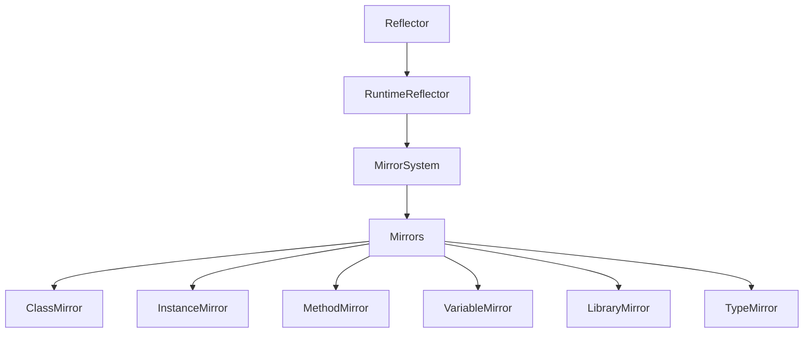

# Platform Reflection Technical Specification

## System Architecture

### Core Components



### Component Responsibilities

#### 1. Reflector
- Static class for central registration and metadata management
- Type registration validation
- Metadata storage for properties, methods, and constructors

```dart
class Reflector {
  static void register(Type type);
  static void registerProperty(Type type, String name, Type propertyType, {bool isWritable = true});
  static void registerMethod(Type type, String name, List<Type> parameterTypes, bool returnsVoid);
  static void registerConstructor(Type type, String name, {List<Type>? parameterTypes, List<String>? parameterNames, List<bool>? isRequired, List<bool>? isNamed, Function? creator});
  static bool isReflectable(Type type);
  static Map<String, PropertyMetadata>? getPropertyMetadata(Type type);
  static Map<String, MethodMetadata>? getMethodMetadata(Type type);
  static List<ConstructorMetadata>? getConstructorMetadata(Type type);
}
```

#### 2. RuntimeReflector
- Singleton class for runtime reflection operations
- Instance creation and manipulation
- Type and class reflection
- Library reflection

```dart
class RuntimeReflector {
  static final RuntimeReflector instance = RuntimeReflector._();
  
  InstanceMirror reflect(Object object);
  ClassMirror reflectClass(Type type);
  TypeMirror reflectType(Type type);
  LibraryMirror reflectLibrary(Uri uri);
  
  InstanceMirror createInstance(Type type, {List<dynamic>? positionalArgs, Map<Symbol, dynamic>? namedArgs, String? constructorName});
}
```

#### 3. MirrorSystem
- Manages the overall reflection system
- Provides access to libraries and types
- Handles special types (dynamic, void, never)

```dart
class MirrorSystem implements MirrorSystemContract {
  static MirrorSystem get instance;
  static MirrorSystem current();
  
  Map<Uri, LibraryMirrorContract> get libraries;
  LibraryMirrorContract findLibrary(Symbol libraryName);
  ClassMirrorContract reflectClass(Type type);
  TypeMirrorContract reflectType(Type type);
  IsolateMirrorContract get isolate;
}
```

### Metadata System

#### Type Metadata
```dart
class TypeMetadata {
  final Type type;
  final String name;
  final Map<String, PropertyMetadata> properties;
  final Map<String, MethodMetadata> methods;
  final List<ConstructorMetadata> constructors;
  final TypeMetadata? supertype;
  final List<TypeMetadata> interfaces;
}
```

#### Method Metadata
```dart
class MethodMetadata {
  final String name;
  final List<Type> parameterTypes;
  final List<ParameterMetadata> parameters;
  final bool returnsVoid;
  final Type returnType;
  final bool isStatic;
}
```

#### Property Metadata
```dart
class PropertyMetadata {
  final String name;
  final Type type;
  final bool isReadable;
  final bool isWritable;
}
```

## Implementation Details

### Registration Process

1. Type Registration
```dart
static void register(Type type) {
  _reflectableTypes.add(type);
  _propertyMetadata.putIfAbsent(type, () => {});
  _methodMetadata.putIfAbsent(type, () => {});
  _constructorMetadata.putIfAbsent(type, () => []);
  _instanceCreators.putIfAbsent(type, () => {});
}
```

2. Property Registration
```dart
static void registerProperty(
  Type type,
  String name,
  Type propertyType, {
  bool isReadable = true,
  bool isWritable = true,
}) {
  registerPropertyMetadata(
    type,
    name,
    PropertyMetadata(
      name: name,
      type: propertyType,
      isReadable: isReadable,
      isWritable: isWritable,
    ),
  );
}
```

3. Method Registration
```dart
static void registerMethod(
  Type type,
  String name,
  List<Type> parameterTypes,
  bool returnsVoid, {
  Type? returnType,
  List<String>? parameterNames,
  List<bool>? isRequired,
  List<bool>? isNamed,
  bool isStatic = false,
}) {
  // Implementation details...
}
```

### Instance Creation

```dart
InstanceMirror createInstance(
  Type type, {
  List<dynamic>? positionalArgs,
  Map<Symbol, dynamic>? namedArgs,
  String? constructorName,
}) {
  // Implementation details...
}
```

### Method Invocation

```dart
InstanceMirror invoke(Symbol methodName, List<dynamic> positionalArguments, [Map<Symbol, dynamic>? namedArguments]) {
  // Implementation details...
}
```

## Performance Optimizations

- Metadata caching on registration for fast lookup
- Use of HashMap for O(1) average case lookups
- Lazy initialization of certain components (e.g., special types in MirrorSystem)
- Reuse of mirrors for repeated operations on the same object

## Error Handling

```dart
class ReflectionException implements Exception {
  final String message;
  ReflectionException(this.message);
  @override
  String toString() => 'ReflectionException: $message';
}

class NotReflectableException extends ReflectionException {
  NotReflectableException(Type type) : super('Type is not reflectable: $type');
}

class InvalidArgumentsException extends ReflectionException {
  InvalidArgumentsException(String message, Type type) : super(message);
}
```

## Platform Considerations

- Full support for VM, Web, Flutter, and AOT compilation
- No use of dart:mirrors, ensuring cross-platform compatibility
- Explicit registration allows for better tree-shaking and smaller code size

## Limitations and Constraints

- Explicit registration required for all reflectable types and members
- Limited support for complex generic types
- No reflection on private members
- No dynamic loading of code or types at runtime

## Future Considerations

- Enhanced generic type support, including variance and type parameter bounds
- Improved metadata capabilities, including custom metadata providers
- Dynamic proxy generation for more advanced use cases
- Potential for code generation tools to automate registration process

## Security Considerations

- No access to private members, maintaining encapsulation
- Controlled reflection surface through explicit registration
- Runtime type checking and validation during reflection operations

## Testing Strategy

- Comprehensive unit tests for all core components (Reflector, RuntimeReflector, MirrorSystem)
- Integration tests simulating real-world usage scenarios
- Performance benchmarks comparing against direct method calls and dart:mirrors (where applicable)
- Cross-platform tests ensuring consistent behavior across VM, Web, and Flutter
- Stress tests with large numbers of registered types and reflection operations

This technical specification provides a detailed overview of the Platform Reflection library's architecture, implementation details, and key considerations. For API documentation and usage examples, please refer to the [README](../README.md) and [Quick Start Guide](quick_start.md).
